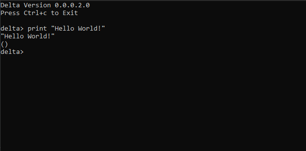

# Delta
Delta is a LISP programming language built on C. It is minimalist, fast and offers a foundation for a complete language. It can continuously change, build up on itself and improve.
The goal of the project is to create a programming language that is easy to write algorithms in, using simple and natural grammars, and then use an interpreter to generate code or use a compiler to compile it into a more heavyweight language.

[LISP is a list processing language](https://www.tutorialspoint.com/lisp/lisp_program_structure.htm). LISPs have little distinction between data and code. They use the same structures to represent both.
Large successful applications built in Lisp include Emacs, AutoCad and Yahoo Store.

## Features:
### Infrastructure Features:
- Reading User Input
- Parsing User Input
- Polish Notation Syntax
- Evaluating User Input
- Printing User Input
- Error Handling
- Reading Expressions
- Printing Expressions
- Evaluating Expressions
- Symbolic Expressions (S-Expressions)
- Quoted Expressions (Q-Expressions)
### Language Features:
- User Defined Variables
- User Defined Functions
- Input Ordering
- Input Equality
- 'If' Function
- Strings
- Comments
- Command Line Arguments:
    - Load Function
    - Builtin Error Function
    - Builtin Print Function

## Technologies / Requirements
TODO
- This project was built on 64-bit Windows 10

# Getting Started
TODO

## Installing
- mpc library

## Usage
To compile:
``$ gcc -o main.exe delta.c mpc.c`` 
Run ``main.exe``

### Instructions
TODO with <screenshots>

## Development Notes
In a Nutshell:
- Delta makes use of the mpc Parser Combinator library.
- User input parsed from mpc library functions, then used it to define grammar with the delta defined language syntax.
- Language syntax was defined using Regex, s-expressions, q-expressions.
- Supports S-Expression input and evaluation - Internal list structure that is built up recursively of numbers, symbols and other lists. In lisp, this structure is called an S-Expression (Symbolic Expression).
- S-expressions are just a number of other expressions between parentheses.
- Expression can be number, operator, string, comment or other S-expression.
- Uses a lisp value (lval) a custom data structure.
- Assigns integers to expression types and use enumerations to assign meanings to the integer values, to encode relationships between the list value structure and its variables.
- Creates an error type to track errors.

#### Reading User Input
Uses an **Abstract Syntax Tree** as underlying data structure. At the leaves of the tree are numbers and operators which are the data to be processed, and the branch contain rules used to traverse, evaluate, and produce the branch.
This is the underlying data structure in mpc:
``c 
typedef struct mpc_ast_t {
  char* tag;
  char* contents;
  mpc_state_t state;
  int children_num;
  struct mpc_ast_t** children;
} mpc_ast_t; 
``
Input is defined with ``tag | contents | state`` fields for data, ``children_num`` and ``children`` for traversal information.
Delta uses Recursion to traverse the tree.

#### Parsing User Input
We code our own grammars, building up parsers that parse more and more compicated languages. Create new rules and define them.
Uses ``mpc`` Parser Combinator library functions. It allows writing normal code that looks like a grammar, or use special notation to write a grammar directly.
Defined a program parser ``Delta`` which calls mpc library functions.

#### Polish Notation Syntax
Representation: The operator always comes first in an expression, followed by numbers or other expressions. `` 1 + 2 + 6 `` is `` + 1 2 6 ``

#### Evaluation
Representation: Take the parse tree as input and outputs the evaluated value
Parsing: Counts and accumulates nodes in the parse tree then checks to see if a tag contains some substring, then recursively calls an evaluation function on it.
The evaluation function performs a corresponding C operation based on inputs.

#### Printing
Passes in the parse tree into the ``eval`` function, then prints the result using C ``printf`` with ``%li`` specifier.

#### Error Handling
When an error is encountered during evaluation, return it right away with a message, and do not perform computation, in order to prevent crash.

#### Reading Expressions
Representation: Takes in an abstract syntax tree
Parsing: Delta reads the program, creates ``lval`` list values using constructors for each type of expression, then constructs a list value that represents it all by converting the abstract syntax tree into an S-Expression. It evaluates this value using normal Lisp rules to get the result of the program. 
Semantics: Added built-in operators, defined as ``symbol``, which allows adding more operators, variables and functions later.

#### Printing Expressions
The print function is modified to print out S-Expressions types.
Delta creates another function that loops over all the sub-expressions of an expression and prints these individually separated by spaces, in the same way they are input.

#### Evaluating Expressions
The evaluation function was adapted to deal with ``lval*``. It takes in some ``lval*`` and transforms it into some new ``lval*``

#### Symbolic Expressions (S-Expressions)
Syntax: S-Expressions are an internal list structure that is built up recursively of numbers, symbols, and other lists. 
Representation: Q-Expressions are surrounded by brackets ``()``
Parsing: The evaluation behavior is such that you look at the first item in the list, take it to be the operator, then look at all other items in the list, and take these as operands to get the result.
Semantics: Added built-in operators, defined as ``symbol``, which allows adding more operators, variables and functions later.

#### Quoted Expressions (Q-Expressions)
Syntax: Q-Expressions are left exactly as they are when encountered by the evaluation function. This makes them ideal to store and manipulate other Lisp values.
Representation: Q-Expressions are surrounded by curly brackets ``{}``
Parsing: Read us
Semantics	Add new functions for evaluating and manipulating this feature. Added built-in operators.

### Language Features:

#### Variables, allows to assign a name to a value, and allows to get a copy of that value later.
Syntax: ``/[a-zA-Z0-9_+\\-*\\/\\\\=<>!&]+/`` (Regular Expression)
Parsing: Use an environment structure to econde a list of relationships between names and values
Semantics: Variable Evaluation, Defining Functions, Error Reporting

#### User Defined Functions
Representation: Functions are stored as ``lval``
Parsing: Uses a builtin Lambda function ``\`` that allows to add two inputs together. Delta uses this to create user defined functions.
Semantics: Function Defining, Function Calling, Defining Arguments

#### Input Ordering
Returns a number ``lval`` either 0 or 1 depending on the equality comparison between the two input ``lval``.

#### Input Equality
Uses a builtin function which tests between two different types of ``lval``

#### If Function
Makes use of the Q-Expressions to encode a computation. The user passes in two Q-Expressions representing the code to be evaluated.

#### Strings
This will allow the program to start building a standard library by loading code from a file and running it. The user can load a file by supplying a string consisting of the file name.
String ``lval`` Constructor, deletion, copying, equality, Type name and Printing functions were updated.
Parsing: ``string  : /\"(\\\\.|[^\"])*\"/ ;``
Semantics: Reading Strings

#### Comments
Comments in Delta are defined by ``;``
Parsing: ``comment : /;[^\\r\\n]*/ ;``

### Command Line Arguments:
#### Load Function
#### Builtin Error Function
#### Builtin Print Function

Now we have a base where can easily define Atoms, Building Blocks, Logical Operators, and Miscellaneous Functions.

## Testing
TODO

## Deployment
TODO

## Roadmap / TODO
- Define a standard library
- Define algorithmic library
- Add more Native Types
- Add User Defined Types
- Add List Literals
- Add OS interaction
- Add User Defined Macros
- Add Variable Hashtable
- Add Pool Allocation
- Add Garbage Collection
- Add Tail Call Optimisation
- Add Lexical Scoping
- Add Static Typing
- Create own mpc library
- Create an interpreter or a compiler to convert LISP back and generate code in another language.
- Update standard library to include more:
    - Syntax
    - Semantics
    - Data Types
    - Procedures
    - Error Recovery
- Incoporate Assembly for metaprogramming/code generation

## License
This project is licensed under the terms of the [MIT](LICENSE) license.

## Credits
- [Build Your Own Lisp](http://www.buildyourownlisp.com/)

