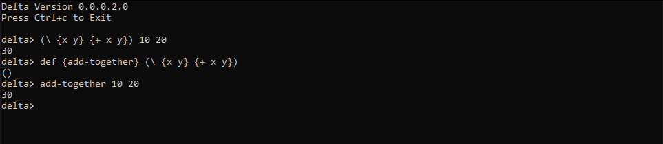

# Delta
Delta is a LISP programming language built on C. It is minimalist, fast and offers a foundation for a complete language. It can continuously change, build up on itself and improve.
The goal of the project is to create a programming language that is easy to write algorithms in, using simple and natural grammars, and then use an interpreter to generate code or use a compiler to compile it into a more heavyweight language.

[LISP is a list processing language](https://www.tutorialspoint.com/lisp/lisp_program_structure.htm). LISPs have little distinction between data and code. They use the same structures to represent both.
Large successful applications built in Lisp include Emacs, AutoCad and Yahoo Store.

## Features:
### Infrastructure Features:
- Interactive Prompt
- Reading User Input
- Parsing User Input
- Polish Notation Syntax
- Evaluating User Input
- Printing User Input
- Error Handling
- Reading Expressions
- Printing Expressions
- Evaluating Expressions
- Symbolic Expressions (S-Expressions)
- Quoted Expressions (Q-Expressions)
### Language Features:
- User Defined Variables
- User Defined Functions
- Input Ordering
- Input Equality
- 'If' Function
- Strings
- Comments
- Command Line Arguments:
    - Load Function
    - Builtin Error Function
    - Builtin Print Function

## Development Notes
In a Nutshell:
- Delta makes use of the mpc Parser Combinator library.
- User input parsed from mpc library functions, then used it to define grammar with the delta defined language syntax.
- Language syntax was defined using regex, s-expressions, q-expressions.
- Supports S-Expression input and evaluation - Internal list structure that is built up recursively of numbers, symbols and other lists. In lisp, this structure is called an S-Expression (Symbolic Expression).
- S-expressions are just a number of other expressions between parentheses.
- Expression can be number, operator, string, comment or other S-expression.
- Uses a lisp value ``lval`` a custom data structure.
- Uses an environment variable ``lenv`` to support variables.
- Assigns integers to expression types and use enumerations to assign meanings to the integer values, to encode relationships between the list value structure and its variables.
- Creates an error type to track errors.
- Uses an *Abstract Syntax Tree* as underlying data structure. At the leaves of the tree are numbers and operators which are the data to be processed, and the branch contain rules used to traverse, evaluate, and produce the branch.

## Technologies / Requirements
TODO
- This project was built on 64-bit Windows 10

# Getting Started
TODO

## Installing
### On Windows
- Clone this repository with ``git clone https://github.com/park-jsdev/delta.git``
#### Compiler
- Install [MinGW](http://www.mingw.org/) and follow their instructions.
#### mpc library
- Make sure to download ``mpc.h`` and ``mpc.c`` from [mpc](https://github.com/orangeduck/mpc).

## Usage
To compile:
``$ gcc -o main.exe delta.c mpc.c`` 
Run ``main.exe``

### Instructions

#### Evaluation and Printing

#### Error Handling

#### Reading Expressions

### Language Features:

#### Variables

#### User Defined Functions

#### If Function

#### Strings

#### Comments
Comments in Delta are defined by ``;``

Now we have a base where can easily define Atoms, Building Blocks, Logical Operators, and Miscellaneous Functions.

#### Defining Your Own Library And Loading
in ``std.d``
``java
; Fibonacci
(fun {fib n} {
  select
    { (== n 0) 0 }
    { (== n 1) 1 }
    { otherwise (+ (fib (- n 1)) (fib (- n 2))) }
})
``

## Testing
TODO

## Deployment
TODO

## Roadmap / TODO
- [x] Define a standard library
- [ ] Define algorithmic library
- [ ] Add more Native Types
- [ ] Add User Defined Types
- [ ] Add List Literals
- [ ] Add OS interaction
- [ ] Add User Defined Macros
- [ ] Add Variable Hashtable
- [ ] Add Pool Allocation
- [ ] Add Garbage Collection
- [ ] Add Tail Call Optimisation
- [ ] Add Lexical Scoping
- [ ] Add Static Typing
- [ ] Create own mpc library
- [ ] Create an interpreter or a compiler to convert LISP back and generate code in another language.
- [ ] Update standard library to include more:
    - Syntax
    - Semantics
    - Data Types
    - Procedures
    - Error Recovery
- [ ] Incoporate Assembly for metaprogramming/code generation

## License
This project is licensed under the terms of the [MIT](LICENSE) license.

## Credits
- [Build Your Own Lisp](http://www.buildyourownlisp.com/)

